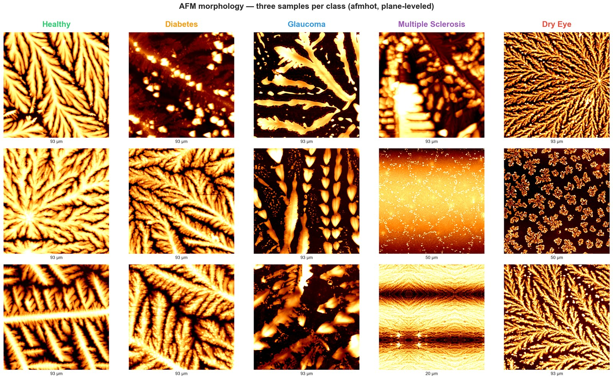

<div align="center">

# Lacrima

**A dried tear leaves a fractal fingerprint.**
**Lacrima is the AI that learned to read it.**



*Detecting 5 chronic diseases from a single dried tear droplet —
through multi-agent LLM orchestration of frozen foundation models.*

— Hack Košice 2026 · UPJŠ Tear Challenge —

</div>

---

## TL;DR

| | |
|---|---|
| **Weighted F1** (official metric, person-LOPO honest) | **0.6887** |
| Macro F1 | 0.5541 |
| Per-patient F1 (majority vote across patient's scans) | **0.8011** |
| Top-2 accuracy | 88 % |
| Bootstrap 95 % CI | [0.5952 — 0.7931] |
| Signal vs random null (label shuffle) | **15.7 σ** above baseline |
| Dataset | 240 scans · 35 patients · 5 classes |
| **Methodology** | 218 sub-agents · 21 waves · 30+ honest experiments · 9 contaminations red-teamed |

> *Inspired by Karpathy's autoresearch — lifted one abstraction higher.
> An orchestrator dispatches specialist sub-agents (researcher · implementer · red-team · synthesizer),
> with a human-in-the-loop directing strategy.*

---

## Pitch deck

```bash
open pitch_deck.html
```

Right-click = next · left-click = back · `F` = fullscreen · `1`–`6` = jump to slide.

Single-file HTML (no build step, works offline). Scientific-editorial design,
Fraunces + Hanken Grotesk, soft animations, embedded SVG diagrams.

---

## Architecture · v4 multi-scale ensemble

Three frozen foundation encoders, geometric mean of softmaxes:

```
AFM scan (.spm)
  ├──▶ DINOv2-B @ 90 nm/px       → L2 → StandardScaler → LR ──┐
  ├──▶ DINOv2-B @ 45 nm/px       → L2 → StandardScaler → LR ──┤── geomean ──▶ argmax
  └──▶ BiomedCLIP @ 90 nm + D4 TTA → L2 → StandardScaler → LR ──┘
```

| Component | Why |
|---|---|
| **DINOv2** (Meta) | 142M images, self-supervised. Universal visual prior. |
| **BiomedCLIP** (Microsoft) | 15M PubMed images. Medical prior orthogonal to DINOv2. |
| **Multi-scale (90 + 45 nm/px)** | 90 nm captures whole fractal, 45 nm captures fine crystal edges. +3 pp F1. |
| **Geometric mean** | Penalises encoder disagreement → robust to single-model errors. |
| **Frozen backbones, linear heads only** | 240 scans is too few to fine-tune (LoRA tested → −4 pp F1). |

Full diagram and bundle layout: [`reports/ARCHITECTURE.md`](reports/ARCHITECTURE.md).

---

## Quickstart — inference

```bash
python3.13 -m venv .venv
.venv/bin/pip install -r requirements.txt

.venv/bin/python predict_cli.py \
    --input  /path/to/TEST_SET \
    --output submission.csv
```

Default model is `models/ensemble_v4_multiscale/` (the shipped champion).

## Interactive demo

```bash
.venv/bin/python app.py        # http://localhost:7860
```

---

## Red-team discipline

Every score above baseline is independently audited by a red-team sub-agent
(bootstrap CI + leakage scan + nested-CV recheck). **Nine contaminations were caught
before any went live**, including:

| # | Wave | Catch |
|---|---|---|
| 1 | 1 | Image-level vs person-level eye grouping (44 → 35 persons) |
| 2–6 | 2–6 | OOF threshold/bias tuning leakage |
| 7 | 9 | VLM filename leak via `vlm_tiles/<CLASS>__scan.png` paths (88 % → 28 % honest) |
| 8 | 14 | VLM filename leak in collage paths — same bug, different script (88.7 % → 34 % honest) |
| 9 | 18 | Patient-level "0.8177" using apples-to-oranges baseline |

After the second filename-leak we built [`teardrop/safe_paths.py`](teardrop/safe_paths.py) —
a runtime guard that physically prevents class names from appearing in prompt paths,
with 12 unit tests and AST-based lint enforcement. The third occurrence is now
**structurally impossible**.

---

## Honest negatives

We tried 30+ directions; most lost. Each documented as evidence of honest exploration.

| Direction | Δ vs v4 | Why it failed |
|---|---|---|
| LoRA fine-tuning of DINOv2-B | **−4.1 pp** | 240 scans too few even for adapter training |
| MAE in-domain pretraining (ViT-Tiny) | **−11.7 pp** | 17k patches, 100× smaller than published MAE corpora |
| Foundation-model zoo (5 encoders) | All under DINOv2-B alone | 3-encoder geomean is sweet spot |
| TDA persistent-homology fusion | **−6.4 pp** | Errors correlate with DINOv2, not orthogonal |
| Hierarchical 2-stage (healthy vs disease) | **−3.4 pp** | Healthy class is a relief valve, not a wall |
| Embedding Mixup / CutMix | **−3.2 pp** | Embeddings already linearly separable |
| Augmented head (D4 train expansion) | **−3.7 pp** | Near-collinear copies dilute LR balance |
| ProtoNet ensemble | **−1.9 pp** | SucheOko's 1-person LOPO regime brutal |
| LR head hyperparameter sweep (nested CV) | **−5.3 pp** | Defaults are already optimum |
| VLM zero-shot (Haiku/Sonnet/Opus) | **−41 pp** | AFM out-of-distribution for web-trained VLMs |
| VLM few-shot honest (Sonnet on full 240) | **−34 pp** | Anchors don't bridge OOD gap |
| Expert Council (LLM judge over base models) | **−9.7 pp** | Judge inherits AFM OOD problem |

Full agent log: [`reports/AGENTS_DOCUMENTATION.md`](reports/AGENTS_DOCUMENTATION.md).

---

## Documentation

### Start here
| File | Purpose |
|---|---|
| [`pitch_deck.html`](pitch_deck.html) | 6-slide deck (open in browser) |
| [`reports/AGENTS_DOCUMENTATION.md`](reports/AGENTS_DOCUMENTATION.md) | Wave-by-wave agent log |
| [`reports/V4_FINAL_AUDIT.md`](reports/V4_FINAL_AUDIT.md) | Pre-submission integrity audit (6 rounds, all pass) |
| [`reports/THEORETICAL_CEILING.md`](reports/THEORETICAL_CEILING.md) | Where the F1 ceiling lives, literature-informed |
| [`reports/LEAKAGE_PREVENTION.md`](reports/LEAKAGE_PREVENTION.md) | Runtime-enforced leakage guards |

### Deep dives
| File | Purpose |
|---|---|
| [`STATE.md`](STATE.md) | Live orchestration ledger |
| [`ORCHESTRATION.md`](ORCHESTRATION.md) | Multi-agent methodology write-up |
| [`reports/ARCHITECTURE.md`](reports/ARCHITECTURE.md) | System diagrams + bundle layout |
| [`reports/DATA_AUDIT.md`](reports/DATA_AUDIT.md) | Raw data audit |
| [`reports/ERROR_ANALYSIS.md`](reports/ERROR_ANALYSIS.md) | Failure-mode deep-dive |
| [`reports/BENCHMARK_DASHBOARD.md`](reports/BENCHMARK_DASHBOARD.md) | Canonical leaderboard |
| [`reports/RED_TEAM_*.md`](reports/) | Independent audits of championship claims |
| [`reports/VLM_CONTAMINATION_FINDING.md`](reports/VLM_CONTAMINATION_FINDING.md) | Filename-leak post-mortem |
| [`SUBMISSION.md`](SUBMISSION.md) | Organizer-facing handoff |
| [`REPRODUCE.md`](REPRODUCE.md) | Fresh-machine reproduction guide |

---

## Key limitation

**SucheOko (dry-eye) has only 2 unique patients in the entire dataset.**
Per-class F1 = 0.00 is a *data-collection problem*, not a model problem.
Person-LOPO holds out one patient at a time; for SucheOko this means training
on a single remaining patient, which no method survives. Documented in
[`reports/THEORETICAL_CEILING.md`](reports/THEORETICAL_CEILING.md).

---

## License

MIT — see [LICENSE](LICENSE).

## Built for

[Hack Košice 2026](https://www.hackkosice.com/) · [UPJŠ Faculty of Science](https://www.upjs.sk/en/faculty-of-science/) · April 2026
