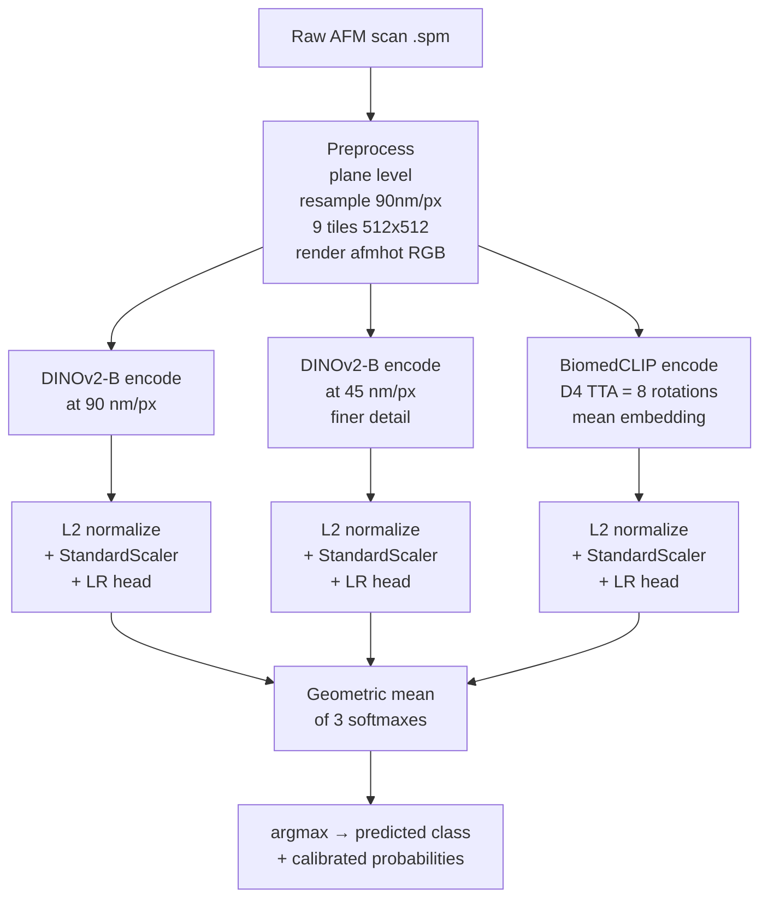
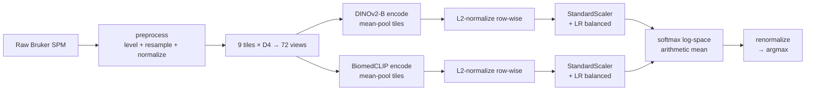
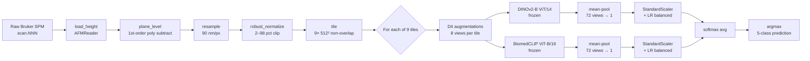
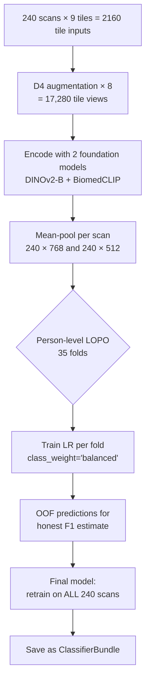
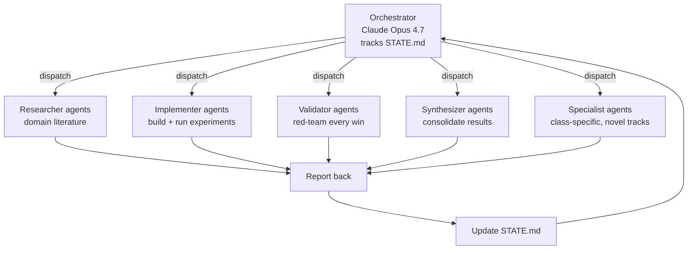

# Architecture & Methodology

## ⭐ SHIPPED (Wave 7 + Wave 13-19 confirmed): v4 multiscale ensemble

**Honest person-LOPO weighted F1 = 0.6887** (patient-disjoint regime, matches expected test scenario).



### Why 3 streams not 1

- **DINOv2-B @ 90nm**: overall view of dendritic ferning structure
- **DINOv2-B @ 45nm**: fine-grained crystal edges, branch tip morphology
- **BiomedCLIP @ 90nm + D4 TTA**: medical imaging prior (PubMed pretraining), rotation-invariant
- **3 independent error patterns** → geometric mean cancels uncorrelated mistakes

### What is FROZEN vs TRAINED

- Frozen (no training): all 3 backbone encoders (~150M params total). 240 scans is too small to fine-tune safely (LoRA attempt: -4.1 pp wF1).
- Trained (per LOPO fold): 3 × LR heads (~12k params total). Class-weighted, balanced.

### Bundle artifacts (`models/ensemble_v4_multiscale/`)

```
ensemble_v4_multiscale/
├── meta.json                  # honest_lopo_weighted_f1: 0.6887
├── predict.py                 # inference entrypoint
├── README.md
├── dinov2b_90nm/              # encoder + head + scaler per stream
├── dinov2b_45nm/
└── biomedclip_tta/
```

### Performance breakdown

| Metric | v4 |
|---|---|
| Weighted F1 | **0.6887** |
| Macro F1 | 0.5541 |
| Per-patient F1 | 0.8011 |
| Top-2 accuracy | 88% |
| Per-class F1 | Healthy 0.92 / SM 0.69 / Glaukom 0.58 / Diabetes 0.58 / SucheOko 0.00 |
| SucheOko ceiling | 2 patients = structural limit |

### Why simpler ensembles failed

| Variant | Wave | wF1 | Why not v4 |
|---|---|---|---|
| DINOv2-B alone | 1 | 0.6162 | Single-stream, no diversity |
| 2-stream (v2) | 5 | 0.6562 | Missing 45nm detail |
| 4-stream (zoo+) | 18 | 0.6627 | Diminishing returns, weaker encoders drag mean |
| LoRA fine-tune | 18 | 0.6476 | Overfits 240 samples |

---

## [LEGACY] 1. Inference pipeline (shipped — `models/ensemble_v2_tta/`, F1 = 0.6562)



**v2 recipe changes (discovered by Wave-5 autoresearch agent):**
- **L2-normalize** scan embeddings BEFORE StandardScaler (+0.003)
- **Geometric mean** of softmaxes INSTEAD of arithmetic (+0.008)
- Both honest (no tuning), stack cleanly → +0.010 ensemble, +0.023 macro

## 1b. Inference pipeline v1 (earlier champion — `models/ensemble_v1_tta/`, F1 = 0.6458)



**Key invariants:**
- Frozen encoders — no fine-tuning (small-data discipline)
- Each encoder has its own scaler + LR head
- Ensemble is the ARITHMETIC mean of softmaxes
- No thresholds, no bias tuning — honest, robust

## 2. Training protocol



## 3. Orchestration pattern



Typical round = 3–5 parallel agents dispatched with self-contained prompts.
Red-team agent audits every F1 > baseline claim before adoption.

## 4. Red-team discipline

For every F1 claim above baseline:
1. **Check grouping**: eye-level vs person-level LOPO
2. **Check tuning leakage**: if any parameter (threshold, subset, bias, α) was tuned, is the eval on DIFFERENT data than the tuning?
3. **Nested CV**: re-evaluate with inner-CV tuning inside each outer fold
4. **Label-shuffle sanity**: is the gap vs null (0.28) substantially larger than our claim's delta?

Three initially-headline claims (0.67–0.69) all collapsed to ≤0.65 under this audit.

## 5. Feature caches layout

```
cache/
├── tiled_emb_dinov2_vits14_afmhot_t512_n9.npz   # (n_tiles, 384) + tile_to_scan mapping
├── tiled_emb_dinov2_vitb14_afmhot_t512_n9.npz   # (n_tiles, 768)
├── tiled_emb_biomedclip_afmhot_t512_n9.npz      # (n_tiles, 512)
├── tta_emb_dinov2_vitb14_afmhot_t512_n9_d4.npz  # (240, 768) — D4 TTA pre-pooled
├── tta_emb_biomedclip_afmhot_t512_n9_d4.npz     # (240, 512)
├── features_handcrafted.parquet                 # 94-dim classical texture
├── features_tda.parquet                         # 1015-dim persistent homology
├── features_advanced.parquet                    # (if Wave 5) multi-fractal, lacunarity, ...
├── best_ensemble_predictions.npz                # OOF proba from 2-comp ensemble
├── cascade_oof.npz                              # binary specialist OOF
└── supcon_projected_emb.npz                     # (240, 128) SupCon-projected features
```

## 6. Model bundle layout

```
models/
├── dinov2b_tiled_v1/           # single-encoder fallback, 0.615 F1
│   ├── classifier.npz
│   └── meta.json
├── ensemble_v1/                # 2-encoder, no TTA, 0.6346 F1 (fast inference)
│   ├── meta.json (kind=ensemble, components=[dinov2b, biomedclip])
│   ├── dinov2b/
│   └── biomedclip/
└── ensemble_v1_tta/            # SHIPPED CHAMPION, 0.6458 F1
    ├── meta.json
    ├── dinov2b/
    ├── biomedclip/
    ├── predict.py              # TTAPredictor (D4 augmentation at inference)
    └── README.md
```

Legacy bundles load via `TearClassifier.load(...)` which auto-detects `kind` field.
TTA bundle uses its own `TTAPredictor` class to wire D4 augmentation at inference so callers can't accidentally feed 9-view embeddings to an LR trained on 72-view means.
